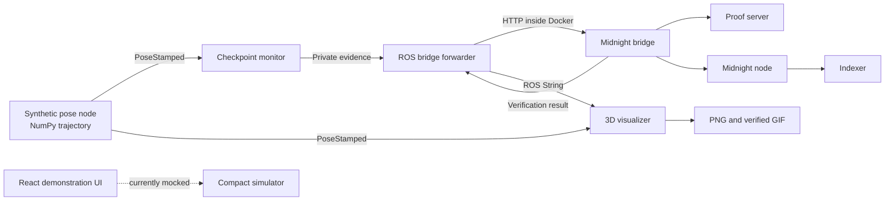
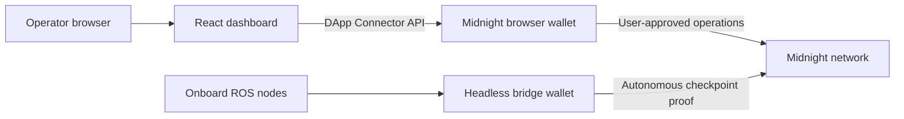

# Midnight Swarm: Architecture and Operations

## Purpose

Midnight Swarm is a local proof-of-concept in which a simulated drone flies to a
checkpoint, ROS 2 detects a stable arrival, and a Compact smart contract verifies the
claim without publishing the raw drone secret or coordinates as ledger fields.

No physical drone is required. The entire Midnight network, bridge, ROS application,
and visualization run locally with Docker Compose.

## System architecture



### Docker services

| Service | Role | Local interface |
| --- | --- | --- |
| `node` | Local Midnight ledger and JSON-RPC/WebSocket node | `ws://127.0.0.1:9944` |
| `indexer` | Indexes local blocks and exposes GraphQL | `http://127.0.0.1:8088/api/v4/graphql` |
| `proof-server` | Generates zero-knowledge proofs | `http://127.0.0.1:6300` |
| `midnight-bridge` | Owns the local wallet, deploys the contract, and submits proofs | Internal port `3001` |
| `ros-simulator` | Runs the four ROS 2 Python nodes | Internal ROS domain `42` |

Only the node, indexer, and proof server development interfaces are bound to host
loopback. The bridge is intentionally reachable only inside the Compose network.

## ROS 2 application

The package is `ros2_ws/src/midnight_checkpoint` and targets ROS 2 Lyrical.

### Nodes and topics

| Node | Subscribes | Publishes | Responsibility |
| --- | --- | --- | --- |
| `synthetic_pose_publisher` | — | `/drone/private_pose` | Uses `numpy.linspace()` to step from `(0, 0, 0)` to `(52, 81, 20)` |
| `checkpoint_monitor` | `/drone/private_pose` | `/midnight/private_checkpoint_evidence` | Requires three consecutive in-bounds samples and emits one evidence message |
| `midnight_bridge_forwarder` | `/midnight/private_checkpoint_evidence` | `/midnight/checkpoint_result` | POSTs evidence to the bridge and republishes the finalized response |
| `trajectory_visualizer` | `/drone/private_pose`, `/midnight/checkpoint_result` | — | Renders the current path and creates the final animation after verification |

The default 2D checkpoint bounds are `x = 40..60` and `y = 70..90`. The Z coordinate
is visualized but is not part of the current contract predicate. Parameters are defined
in `ros2_ws/src/midnight_checkpoint/config/checkpoint.yaml`.

The visualization uses Matplotlib's headless `Agg` backend, so an X server is not
required. Docker mounts `/demo-output` to the repository's `demo-output/` directory:

- `trajectory-current.png` is refreshed during the flight.
- `midnight-checkpoint.gif` is created only after ROS receives a successful Midnight result.

## Compact contract

The contract is `contract/src/checkpoint.compact`. The bridge compiles it with Compact
compiler 0.31.1 during its image build.

### Public ledger state

The following exported ledger fields are public on-chain state:

| Field | Meaning |
| --- | --- |
| `checkpointCommitment` | Hash commitment to the permitted X/Y bounds |
| `authorizedDroneCommitment` | Hash commitment to the drone secret |
| `checkpointReached` | Whether a valid checkpoint proof has been accepted |
| `verifiedProofCount` | Number of accepted proofs |

The contract address, transaction identifier, block height, commitments, and resulting
ledger state are public.

### Private proof material

`proveCheckpoint` receives the observed X/Y position, bounds, and drone secret as proof
inputs. It proves all of the following:

1. The supplied bounds reproduce `checkpointCommitment`.
2. The supplied secret reproduces `authorizedDroneCommitment`.
3. The position is within the supplied bounds.
4. The checkpoint has not already been verified.

The circuit then sets `checkpointReached` and increments `verifiedProofCount`. It does
not write the raw position, bounds, or secret into exported ledger state.

This privacy boundary applies to the ledger. Before proving, evidence travels as a ROS
message and as HTTP within the local Docker network. Those local transports are not
encrypted and should be replaced or hardened before deployment on real hardware.

## Bridge lifecycle

At startup, `bridge/server.mjs`:

1. Connects to the local node, indexer, and proof server.
2. Derives the pre-funded local genesis wallet and waits for synchronization.
3. Registers NIGHT outputs for DUST generation when required.
4. Waits until spendable DUST is available.
5. Generates or loads the 32-byte drone secret.
6. Computes the checkpoint and drone commitments.
7. Deploys the Compact contract and exposes a healthy status.

For each accepted ROS submission, it validates integer ranges and configured bounds,
calls `proveCheckpoint`, balances and submits the transaction, waits for finalization,
then returns public transaction metadata to ROS.

`DRONE_SECRET_HEX` is supplied through `MIDNIGHT_DRONE_SECRET_HEX` when configured.
Otherwise, the bridge creates an ephemeral random secret on each start. The bridge does
not log the secret or raw evidence.

The bridge pins Midnight.js 4.1.1, Compact runtime 0.16.0, and on-chain runtime 3.0.0.
The explicit on-chain runtime pin is important: multiple physical runtime copies create
incompatible JavaScript `StateValue` class identities during transaction construction.

## Repository layout

```text
midnight-swarm/
├── contract/                 Compact source and simulator tests
├── bridge/                   Local Midnight wallet and HTTP/Compact bridge
├── ros2_ws/                  ROS 2 workspace, Docker image, and Python nodes
├── web/                      React/Vite demonstration dashboard
├── agents/ and skills/       Development-agent guidance; not runtime services
├── docker-compose.yml        Complete local network and application topology
├── README.md                 Quick-start documentation
└── ARCHITECTURE.md           This architecture and operations reference
```

The React dashboard currently uses its TypeScript simulation layer and is not the source
of truth for the Dockerized ROS-to-Midnight transaction. The Docker logs, bridge health
response, indexer, and ROS result topic are the authoritative runtime signals.

## Browser wallet integration

The official [React wallet-connect guide](https://docs.midnight.network/guides/react-wallet-connect)
is relevant to the `web/` dashboard, but not to the autonomous ROS-to-bridge path.

Midnight browser wallets expose an initial DApp Connector API under `window.midnight`.
The keys are generated identifiers, so the UI must enumerate `Object.values(window.midnight)`
instead of assuming a fixed property such as `window.midnight.mnLace`. If multiple wallets
are installed, the application should show a wallet selector rather than silently choosing
one. The selected wallet is connected with the network identifier appropriate to the
environment:

- `undeployed` for a compatible local development network;
- `preview` for Preview;
- `preprod` for Preprod.

After authorization, the dashboard can call `getUnshieldedAddress()`,
`getConfiguration()`, and `getConnectionStatus()` to display the connected identity and
service configuration. The wallet extension must be installed, unlocked, synchronized,
and configured for the same network as the application.

### Where it fits



Browser wallet integration would improve the dashboard by providing:

- explicit operator identity and connection status;
- wallet-mediated signing and user-approved transactions;
- network-aware service configuration;
- a path to balances and transaction history;
- removal of the current mocked wallet connection state.

It does **not** replace the bridge wallet. The drone pipeline must submit evidence without
a browser window, extension prompt, or human click. The bridge therefore remains a
headless service account for autonomous checkpoint proofs. A production design should
give the browser operator and onboard drone separate keys and permissions.

### Proposed implementation sequence

1. Add `@midnight-ntwrk/dapp-connector-api` to the `web` workspace.
2. Add TypeScript declarations for the injected `window.midnight` registry.
3. Enumerate installed wallets and render a safe wallet-choice interface.
4. Connect using a configurable network ID rather than hard-coding Preprod.
5. Store the connected API in React state or context and re-check connection status.
6. Display a shortened public address while retaining the complete value for copying.
7. Keep checkpoint proof submission on the bridge; use the browser wallet only for
   operator-authorized actions and read-only account presentation.
8. Query public contract state through the indexer so viewing mission status does not
   require a wallet connection.

The guide is a connection foundation, not a complete contract integration. Contract
deployment/calls, proof-provider wiring, network endpoint compatibility, reconnect
behavior, and transaction-state UI still require separate implementation and testing.

## Running the complete demo

```bash
sudo docker compose up -d --build --force-recreate midnight-bridge ros-simulator
sudo docker compose logs -f --tail=200 midnight-bridge ros-simulator
```

Expected successful messages include:

```text
Checkpoint contract deployed and local bridge is ready
Checkpoint evidence ready for the local Midnight bridge
Checkpoint proof finalized on the local Midnight network
Compact bridge verified checkpoint evidence
Midnight-verified 3D animation saved
```

Inspect status and artifacts:

```bash
sudo docker compose ps -a
sudo docker compose exec midnight-bridge \
  node -e "fetch('http://127.0.0.1:3001/health').then(r=>r.json()).then(console.log)"
ls -lh demo-output/
xdg-open demo-output/midnight-checkpoint.gif
```

A bridge health response with `status: ready` means wallet synchronization and contract
deployment succeeded. It does not by itself prove that the later checkpoint transaction
finalized; use the transaction log and ROS result for that distinction.

Stop the environment with:

```bash
sudo docker compose down
```

## Testing

JavaScript/Compact and web checks:

```bash
npm test
npm run build
npm run lint
```

ROS-independent Python geometry tests:

```bash
cd ros2_ws/src/midnight_checkpoint
uv run ruff check midnight_checkpoint test
uv run pytest
```

## Current limitations

- The drone and sensors are synthetic; there is no flight controller integration.
- The checkpoint contract verifies X/Y only, while the animation is three-dimensional.
- ROS and bridge traffic is trusted local-network traffic, not production-secured transport.
- The bridge uses a development genesis wallet and the `undeployed` network identifier.
- The generated secret is ephemeral unless explicitly configured.
- The Matplotlib animation is rendered after verification rather than displayed as a GUI window.
- The React dashboard is a separate mock demonstration and is not yet connected to the live bridge.
- Browser wallet connection is documented as a roadmap item but is not yet implemented.
- This is a single-checkpoint, single-drone demonstration, not a production swarm coordinator.
- Ganache is incompatible because Midnight is not an Ethereum/EVM chain.

## Production-hardening direction

Before placing this on a real drone, separate secret handling into hardware-backed storage,
authenticate and encrypt ROS/bridge communication, validate timestamps and replay protection,
add a Z-bound or geospatial coordinate model, persist deployment metadata, use a non-genesis
funded wallet, add retry/idempotency semantics, connect an operator dashboard to the indexer,
and conduct contract, bridge, and operational security reviews.

### Follow-on mission coordinator

A future ROS mission-coordinator agent should read the public Compact contract state through
the Midnight indexer. When it observes that the first drone's current task has finalized
successfully (`checkpointReached == true`, with the expected contract/task identity), it
should publish that drone's next assignment on a dedicated ROS task topic.

```text
public contract state
  -> mission-coordinator agent
  -> validate finalized task/drone identity
  -> atomically mark assignment consumed
  -> publish next task for drone one
```

This agent must react to finalized public state rather than bridge readiness or an unfinalized
ROS observation. It should persist the last consumed contract event or task sequence number,
making restarts idempotent and preventing the same completion from starting the next step
twice. The next assignment should reference a new checkpoint commitment rather than exposing
private coordinates through public contract state.
