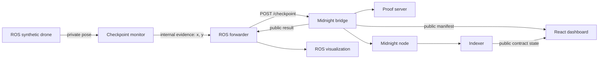

# Midnight Swarm Architecture

## Runtime Flow



The bridge deploys one checkpoint contract for each of `MS-01`, `MS-07`, and `MS-12`.
ROS triggers the first proof. After it verifies, the bridge deterministically submits an
invalid second claim and a valid third claim. The expected ledger state is
`true, false, true`.

## Components

| Component      | Responsibility                                                                       |
| -------------- | ------------------------------------------------------------------------------------ |
| `contract/`    | Verifies committed bounds, credential authorization, and private point inclusion.    |
| `bridge/`      | Owns wallet, bounds, credentials, deployments, proof calls, and public manifest.     |
| `ros2_ws/`     | Generates a synthetic pose, detects arrival, retries submission, and renders output. |
| `web/`         | Shows Mock or indexer-backed Local mission state; contains no wallet.                |
| Docker Compose | Runs the node, indexer, proof server, bridge, and ROS simulator.                     |

`midnight-bridge` is reachable only on the Compose network. Only the development node,
indexer, proof server, and Vite interfaces are exposed to host loopback.

## Bridge Interface

`GET /health` reports initialization status and public deployment addresses. It contains no
private fields.

`POST /checkpoint` accepts:

```json
{ "droneId": "MS-01", "evidence": [52, 81] }
```

Success returns only status, source, drone ID, contract address, transaction ID, and block
height. Errors use sanitized codes: `NOT_READY`, `BUSY`, `INVALID_CLAIM`, or
`INTERNAL_ERROR`. A successful duplicate `MS-01` submission returns the cached public result.

## Public and Private Data

Private inside ROS and the bridge:

- observed coordinates and trajectory;
- checkpoint bounds;
- drone credentials;
- raw circuit and wallet errors.

Public:

- pseudonymous mission and drone IDs;
- contract addresses and commitments;
- `checkpointReached` and `verifiedProofCount`;
- transaction identifiers, block heights, and sanitized local rejection events.

The manifest volume exposes only `web/public/mission-manifest.json`. Private state stores,
ROS evidence, and bridge secrets are neither mounted into `web/` nor logged. Internal ROS
and HTTP transport is trusted local-demo infrastructure and is not production-secured.

## Dashboard Contract

The dashboard loads the public manifest and subscribes to all three addresses through the
indexer. Verified states are labeled `ON-CHAIN`; `MS-07` is labeled `LOCAL` because its
rejected proof does not mutate ledger state. Missing services leave Mock mode usable.

## Version Constraint

The bridge keeps a direct `@midnight-ntwrk/onchain-runtime-v3@3.0.0` dependency. Removing
that pin can install incompatible physical copies whose `StateValue` class identities fail
during transaction construction.

## Scope

The demo uses synthetic integer grid coordinates, a development wallet, one checkpoint per
contract, and trusted local transport. Browser wallets, real drones, authentication,
deployment, durable mission history, and production hardening remain in `BUILD_PLAN.md`.
