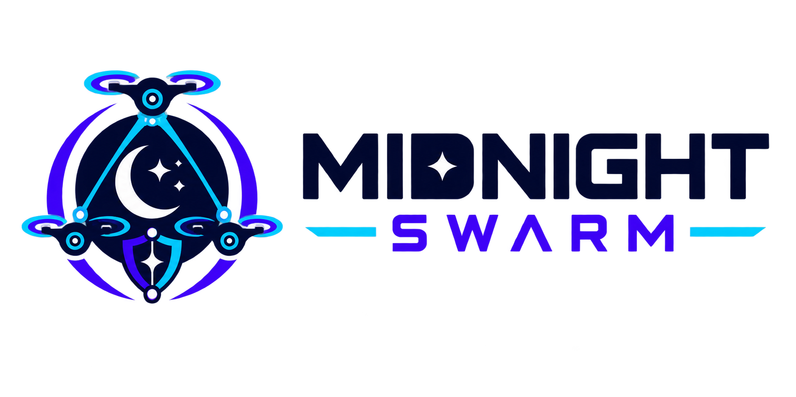
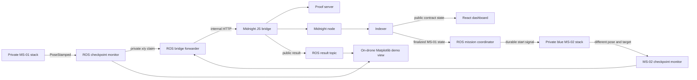

# Midnight Swarm



**Private robot telemetry in. Verifiable mission progress out.**

Midnight Swarm is a ROS 2 and Midnight proof-of-concept for autonomous systems that must
prove they completed a task without publishing their location, route, sensor data, or
credentials. In the live demo, two simulated drones complete different private checkpoints
in sequence. Drone 2 starts only after a ROS mission coordinator reads finalized proof of
drone 1's completion from the Midnight indexer.

> The blockchain learns that the checkpoint rule was satisfied—not where the drone flew.

## Hackathon Demo

The focused end-to-end path is complete:

1. MS-01 publishes a private `geometry_msgs/PoseStamped` trajectory.
2. Its monitor requires three consecutive in-bounds samples and submits a Compact claim.
3. Midnight finalizes MS-01's checkpoint proof.
4. The ROS mission coordinator reads that finalized public state through the indexer.
5. Only then does it publish the durable MS-02 start signal.
6. Blue MS-02 flies to a different target and submits its own independent proof.
7. The dashboard reaches 50% after MS-01 and 100% after MS-02 finalizes.

The demo includes a persistent 15 FPS Matplotlib view only to show judges where the
simulated drone actually is. It runs inside the simulated drone's ROS environment and reads
the private pose topic locally. Neither the window, its frames, nor the trajectory is
published to Midnight, the indexer, the bridge API, or the web dashboard.

**Demo video:** _Add the public, two-minute-or-shorter submission video URL here._

## Why This Is Different

Most robot dashboards centralize raw telemetry. Putting that data on a blockchain makes the
exposure permanent. Midnight Swarm instead makes a narrow mission claim independently
verifiable while keeping operational evidence private.

This pattern applies to:

- inspection robots proving that an assigned zone was visited;
- delivery robots proving arrival without publishing a customer location;
- emergency-response drones proving coverage without exposing a search path;
- industrial fleets proving geofence or maintenance-policy compliance;
- autonomous agents proving that a private model output satisfied an operational rule.

## AI Track Alignment

AI-powered robots commonly turn private camera, lidar, localization, and planning data into
actions. Midnight Swarm provides the verification boundary after that private inference:
the robot or model keeps its sensitive inputs and detailed output local, while Midnight
proves that the resulting action followed a committed mission rule.

The hackathon demo intentionally uses a deterministic NumPy trajectory instead of claiming
to include an ML model. This makes the privacy boundary and proof result reproducible. A
robotics team can replace only `synthetic_pose_publisher` with its perception, localization,
or navigation stack; the checkpoint monitor, bridge, Compact circuit, and dashboard remain
unchanged.

```text
private sensors -> perception/navigation model -> ROS PoseStamped
                                                -> checkpoint monitor
                                                -> Compact proof
                                                -> public verified outcome
```

## Technical Architecture



| Layer             | Technology                           | Responsibility                                                  |
| ----------------- | ------------------------------------ | --------------------------------------------------------------- |
| Robotics          | ROS 2 Lyrical, Python                | Pose ingestion, stable checkpoint detection, result publication |
| Privacy proof     | Compact 0.23 / toolchain 0.31.1      | Proves committed bounds, authorization, and point inclusion     |
| Chain integration | Node.js, Midnight.js                 | Wallet, deployment, proof generation, transaction finalization  |
| Local network     | Midnight node, indexer, proof server | Ledger consensus, public queries, zero-knowledge proving        |
| Operator UI       | React 19, Vite, TypeScript           | Mock presentation and read-only indexer-backed Local mode       |
| Visualization     | Matplotlib                           | On-drone/local-only demo view plus private PNG/GIF artifacts    |

### Public versus private data

| Private                     | Public                             |
| --------------------------- | ---------------------------------- |
| Raw X/Y/Z positions         | Pseudonymous mission and drone IDs |
| Complete trajectory         | Contract address and commitments   |
| Checkpoint bounds           | `checkpointReached`                |
| Drone secret                | `verifiedProofCount`               |
| Sensor/model inputs         | Transaction ID and block height    |
| Raw wallet and proof errors | Sanitized verification status      |

The ROS and bridge HTTP traffic is trusted local-demo transport, not production-secured
transport. It must be authenticated and encrypted before using real mission data.

## Run It

### Requirements

- Node.js 24.11.1 or newer and npm 11 or newer
- Docker Engine with Compose v2
- Compact developer tools with toolchain 0.31.1
- A Linux X11/XWayland desktop only if using the live Matplotlib window
- `uv` only for the ROS-independent Python test suite

Install dependencies and select the compiler:

```bash
compact update 0.31.1
npm install
cp .env.local.example .env
```

If `compact` is not installed, follow the official
[Compact releases](https://github.com/midnightntwrk/compact/releases) installer first.

### 1. Start Midnight and the dashboard

```bash
npm run live
```

Open the Vite URL (normally `http://localhost:5173`) and select **Local**. Both drones should
remain idle at 0%; ROS no longer starts automatically.

### 2. Start the ROS flight

In a second terminal, choose one mode:

```bash
# Headless ROS run
npm run ros:start

# ROS run with the private live Matplotlib window
env MIDNIGHT_SWARM_LIVE_PLOT=1 npm run ros:start
```

Each on-drone window opens once and updates a persistent 3D plot at 15 FPS. MS-01 is red;
MS-02 is blue and remains stationary until the coordinator reads finalized MS-01 state from
the blockchain. These are local views into the simulated drone container, not network
streams or dashboard feeds. The website reaches 50% after MS-01 finalizes and 100% after
MS-02 finalizes.

Watch the authoritative runtime messages:

```bash
docker compose logs -f --tail=200 midnight-bridge ros-simulator
```

Expected sequence:

```text
Midnight bridge ready for ROS evidence.
Checkpoint evidence ready for the local Midnight bridge
Compact bridge verified checkpoint evidence
Finalized MS-01 state observed; MS-02 start published
MS-02 synthetic private pose stream started
Checkpoint evidence ready for the local Midnight bridge
Compact bridge verified checkpoint evidence
Midnight-verified 3D animation saved
```

Generated artifacts:

```text
demo-output/ms-01-checkpoint-current.png
demo-output/ms-01-checkpoint.gif
demo-output/ms-02-checkpoint-current.png
demo-output/ms-02-checkpoint.gif
```

These files are written through a local development volume solely for the hackathon demo.
They are never submitted to the bridge or blockchain and are not consumed by the website.

Stop and reset the local environment:

```bash
npm run midnight:down
```

### Offline UI fallback

```bash
npm run dev
```

Use **Mock** mode and select **Start Mission**. This deterministic three-drone presentation
requires no blockchain or ROS services and remains available as a demo fallback.

## Integrate It into an Existing ROS 2 Robot

The reusable robotics component is the `midnight_checkpoint` package:

```text
ros2_ws/src/midnight_checkpoint/
```

Your robot does not need to know about wallet keys, Compact compilation, or Midnight.js.
It only needs to publish a standard pose and consume an optional public result.

### ROS interface

| Direction       | Topic                                        | Message                     | Purpose                             |
| --------------- | -------------------------------------------- | --------------------------- | ----------------------------------- |
| Input           | `/drone/{id}/private_pose`                   | `geometry_msgs/PoseStamped` | Private robot/localization position |
| Internal output | `/midnight/{id}/private_checkpoint_evidence` | `std_msgs/UInt32MultiArray` | Local `[x, y]` proof input          |
| Public result   | `/midnight/{id}/checkpoint_result`           | `std_msgs/String`           | Sanitized JSON verification result  |
| Chain handoff   | `/drone/ms02/start`                          | `std_msgs/Bool`             | Durable start after MS-01 finality  |

The monitor converts positions to non-negative fixed-point integers and emits exactly once
after `required_samples` consecutive observations satisfy the configured bounds. It does
not log positions. The forwarder retries temporary bridge failures and republishes only the
public result.

### Integration steps

1. Copy `ros2_ws/src/midnight_checkpoint` into your ROS 2 workspace `src/` directory.
2. Remap `pose_topic` to your localization output, using an adapter if its message type is
   not `PoseStamped`.
3. Set `units_per_meter`, checkpoint bounds, and `required_samples` in
   `config/checkpoint.yaml`.
4. Set `bridge_url` to a reachable trusted bridge endpoint.
5. Build and launch the package.

```bash
cd your_ros2_workspace
source /opt/ros/lyrical/setup.bash
rosdep install --from-paths src --ignore-src -y
colcon build --symlink-install
source install/setup.bash
ros2 launch midnight_checkpoint synthetic_checkpoint.launch.py
```

For a real robot, replace or omit the `synthetic_pose` launch action and retain:

- `checkpoint_monitor` for stable private-arrival detection;
- `bridge_forwarder` for proof submission and sanitized results;
- `mission_coordinator` when a later robot must wait for finalized public state;
- `trajectory_visualizer` only when a local private operator view is appropriate.

The current bridge accepts pseudonymous drone IDs `MS-01` and `MS-02` with unsigned 32-bit
X/Y values. Each has independent committed bounds, credentials, and contract state.
Production adapters should add authenticated transport, replay protection, timestamps,
calibrated coordinate conversion, and hardware-backed drone credentials.

## Compact Claim

`contract/src/checkpoint.compact` proves all of the following in one transaction:

1. The supplied private bounds match the public checkpoint commitment.
2. The supplied private drone secret matches the authorized-drone commitment.
3. The private X/Y observation is within those bounds.
4. The checkpoint has not already been verified.

On success, the contract sets `checkpointReached` and increments `verifiedProofCount`. Raw
coordinates, bounds, and credentials are never exported as ledger fields.

## Repository Guide

```text
contract/       Compact source, generated bindings, and valid/invalid proof tests
bridge/         Headless wallet, deployment, proof submission, and sanitized HTTP API
ros2_ws/        Reusable ROS 2 package, simulator, and private visualization
web/            React dashboard and public mission-manifest consumer
docker-compose.yml
                Local Midnight node, indexer, proof server, bridge, and ROS topology
ARCHITECTURE.md Detailed trust boundaries and component contracts
BUILD_PLAN.md   Completed milestones and production roadmap
AGENT.md        Scope and privacy rules for contributors and coding agents
```

The README is the primary reviewer and developer entry point. The other Markdown files are
kept intentionally focused rather than duplicated wholesale here.

## Validation

```bash
npm run contract:compile
npm test
npm run build
npm run lint
npm run format:check
docker compose config --quiet

cd ros2_ws/src/midnight_checkpoint
UV_CACHE_DIR=/tmp/midnight-swarm-uv-cache uv run ruff check midnight_checkpoint test
UV_CACHE_DIR=/tmp/midnight-swarm-uv-cache uv run pytest
```

Current focused checks cover valid and rejected Compact claims, bridge input sanitization,
dashboard state transitions, manifest validation, and ROS checkpoint geometry.

## Business Value and Product Path

Midnight Swarm can become verification middleware for robotics fleets. Robot vendors keep
their existing ROS and AI stacks; operators, customers, insurers, and regulators receive a
shared proof of task completion without gaining access to sensitive telemetry.

A launch path would package the ROS adapter and managed proof bridge as an SDK/service,
then add multi-robot mission contracts, authenticated device identity, replay protection,
encrypted transport, durable event history, and deployments on a supported Midnight
network. Revenue could come from per-robot fleet subscriptions, verified-event volume, or
compliance integrations for regulated operators.

## Current Scope and Honest Limitations

- The drone and sensors are synthetic; no physical flight controller is connected.
- The reproducible demo uses deterministic motion, not an included ML model.
- The contract verifies X/Y only; Z is visualized but not part of the predicate.
- ROS/HTTP transport is trusted local plaintext inside Docker Compose.
- The bridge uses a development wallet and local `undeployed` network.
- Local mode supports two sequential drones and one checkpoint per drone per fresh run.
- The browser is read-only and has no wallet integration.
- This prototype proves mission progress; it does not control flight.
